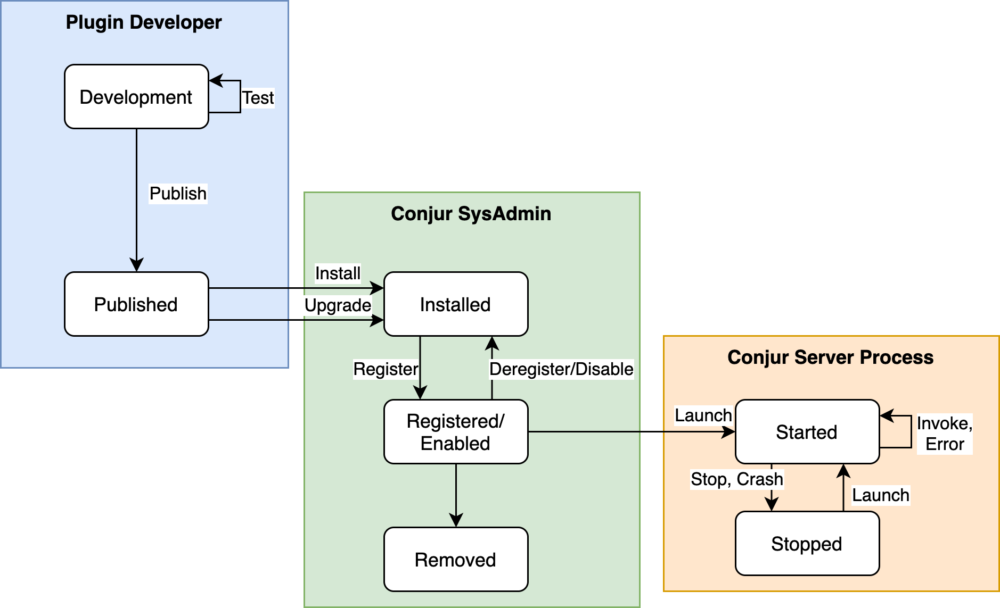
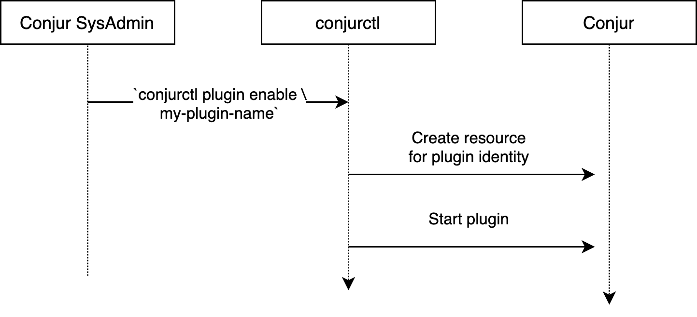
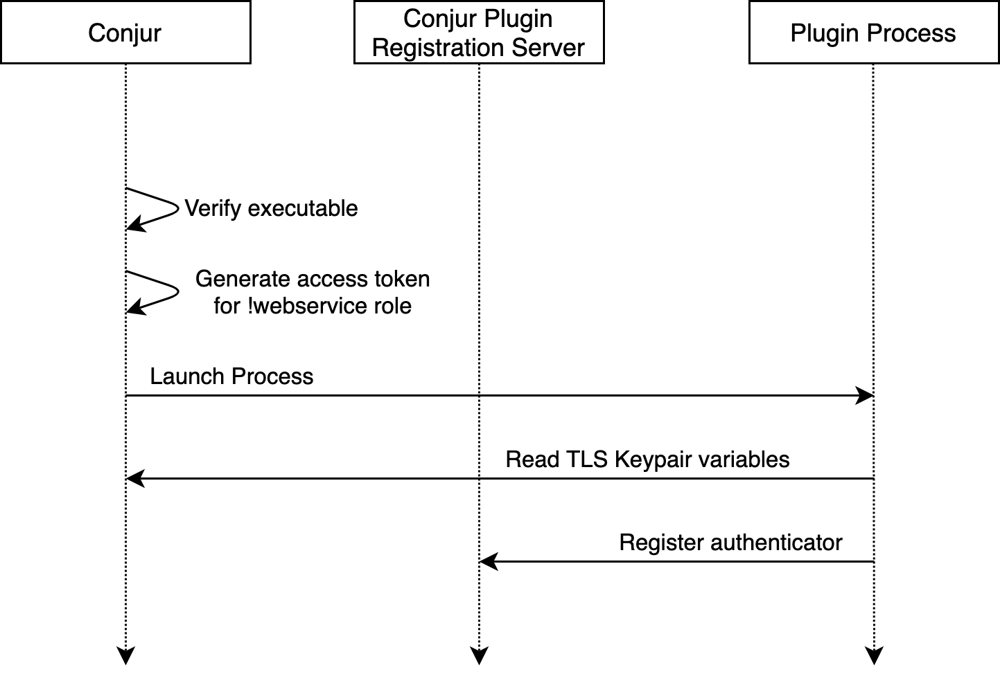

# gRPC Plugins

## Description

This design document describes the design and experience for gRPC based Conjur
plugins.

## Background

Plugins are a pattern to enhance a software system by allowing end-users and
administrators to extend or customize its behavior without modifying the
system source code. Plugins are software components loaded into a system
at runtime, and can be implemented in separate source code repositories.

Conjur currently provides some points for extensibility for authentication
and secrets rotation. However these require the extensions to be implemented
in the Conjur repository and may not be loaded at runtime.

There are additional opportunities for extension in policy validation and
automation that will also benefit from extension through third-party plugins as
we seek to enhance our customers' operational efficiencies.

## Architectural Drivers

There are some key architectural considerations for how a plugin extension
capability should operate in Conjur.

### Security

Plugins should not compromise the confidentiality, availability, or integrity
of Conjur secrets management.

- **Confidentiality:**

    While a plugin may interact with secret values as part of its functionality,
    these interactions must be least privilege and fully audited.

    For example:

    - Conjur plugins must retrieve secret values through the Conjur API using an
      authenticated session.
    - Connections between Conjur and Plugins must be encrypted.
    - Conjur plugins and the Conjur core must not share memory.
    - Conjur plugins must not have privilege to access the Conjur database.

- **Availability:**

    A defective plugin must not negatively impact the overall performance or
    availability of Conjur secrets manager services.

    For example:

    - A plugin that crashes must not crash Conjur or cause Conjur
      services to fail.

- **Integrity:**

    Conjur secrets management is a trusted security platform. As such, the same
    level of trust and verification must be applied to plugins.

    For example:

    - Conjur plugins must be signed.
    - The plugin signature and hash must be verified before loading the plugin.
    - Conjur plugin interactions with Conjur must identifiable and traceable to
      the plugin.
    - Conjur plugin lifecyle (install/uninstall) must be audited.

## Availability

In addition to the security concerns for availability addressed in the **Security**
section, there are further availability drivers for a plugin implementation:

- Plugins should be installed/removed without requiring a system restart.

## Interoperability

- The system should consider that plugins may be developed for different versions
  of the plugin and Conjur API.

- Plugins may be implemented in programming languages other than Ruby.

## Performance

- Building on the **Security** concerns for availability, the impact of Conjur
  plugins should be minimized and observable. For example, it should be possible
  to view a report of how long an API requests spends in each installed plugin.

## Testability

There are testability drivers for both plugin developers and end-users.

- How does a plugin developer test their plugin?

- How does a Conjur secrets manager operator evaluate a plugin for use?

## Technical Design

### Process Isolation

An important conclusion for the architecture drivers is that plugins must run
in a separate process space from the Conjur API server. This protects secrets
stored in memory or the Conjur database. It also protects the Conjur server
process from software faults in a plugin that could lead to a crash.

### RPC Interface

Process isolation between the Conjur API process and the plugin process dictate
that a non-memory based communication protocol is required for interaction between
Conjur and the plugin.

This proposal suggests using a [gRPC-based](https://grpc.io/) framework for
communication to leverage the benefits of a network based protocol with the
additional value from strongly typed and versioned interface specifications.

- A network protocol provides excellent support for security considerations (e.g. TLS).

- A strongly spec-ed interface reduces the uncertainty and risk in developing
a plugin.

- A versioned spec promotes greater interoperability between plugin and Conjur
  server versions.

- gRPC offers greater specificity and tooling for interface development than
  HTTP alone.

### Plugin lifecycle



#### Development

The API spec for plugins is available as Protocol Buffer files. These are used
to implement a new executable application that implements an authenticator
server and a client for the plugin registration server

##### Open Questions

- How to "get started?"
- How to test plugins?

#### Published

To publish a plugin, the executable needs to be made available for download. This
can be as simple as hosting it for download (e.g. GitHub releases) or extend to
the use of a registry.

##### Open questions

- How to publish plugins in a secure way (e.g. signing)?

#### Installation

Plugin installation may occur as either a new installation, or upgrading a
previously installed plugin to a new version.

- Place the executable in a specified directory

#### Registration / Enablement

A second phase of installation is making Conjur aware of the plugin, how it can
verify the integrity of the executable file, and how it should launch the executable.

Registration also provides an opportunity for Conjur to handle internal resource
and policy management for the plugin. Specifically for each plugin we want to
create a Role for the plugin to handle access control and configuration settings.



When a plugin is registered Conjur performs the following actions:

- It loads a policy to define a role for the plugin and variables for a TLS
  keypair for mutual TLS.

    An example policy for this is:

    ```yaml
    - !policy
      id: <my-plugin-name>
      body:
      # Takes the same ID as the parent policy. Webservice behaves as a role
      # and can be granted access to resources and issues access tokens.
      - !webservice
        annotations:
          plugin/sha256: 496b6c14c99cde51a4c8adb6ccf9d9e181c65874af37e1ab42aa087803edcfd8
          # plugin/arguments: --debug

      - !variable
        id: tls-private-key
        owner: !webservice

      - !variable 
        id: tls-certificate
        owner: !webservice

    # Allow the plugin to read the CA certificate
    - !grant
      role: !group ca-certificate-users
      member: !webservice my-plugin-name
    ```

    This will get loaded into the `/conjur/plugin` policy.

    This also assumes Conjur has a signing key to issue these certificates. For
    now, we assume that this is created by the first call to `conjurctl plugin enable ...`.
    The policy for this would be similar to:

    ```yaml
    - !policy
      id: plugin
      body:
      - !variable ca-private-key

      - !variable ca-certificate

      - !group ca-certificate-users
  
      - !permit
        resource: !variable ca-certificate
        role: !group ca-certificate-users
        privileges: [ read, execute ]
    ```

- It generates new TLS private key, issues a new certificate from the plugin CA,
  and stores this new keypair in the `/conjur/plugin/<my-plugin-name>/tls-private-key`
  and `/conjur/plugin/<my-plugin-name>/tls-certificate`. (OPEN QUESTION: How
  does rotation work for these certificates? When are they rotated?)

- It notifies Conjur that there is a new plugin to start. (OPEN QUESTION: How?).

#### Startup

Plugins are started with the Conjur server starts, or when a new plugin is installed
after Conjur is already running.



- Conjur verifies the executable matches the registration (by checking the hash).

- Conjur issues a new access token for the Webservice role for the plugin. The
  short-lived access token is added to the plugin process' environment.

- Conjur provides the plugin registration API endpoint (port) to the plugin
- process' environment.

- Conjur launches the plugin, optionally with any arguments provided at
  registration.

Once the plugin process starts the plugin then:

- Reads its TLS key pair from Conjur, using the access token from the
  environment.

- Reads the Conjur plugin CA from Conjur.

- The plugin connects to the runtime plugin registration server and publishes
  the authenticator(s) available along with the port and public key to use.

##### Open questions

- Can this access token have a shorter life than the default 8 minutes?

#### Invocation

Plugin authenticator instances are configured in policy the same as built-in
authenticators, with any authenticator specific configuration added to the policy
object as annotations.

When an authenticator plugin is invoked, Conjur sends the webservice
object, an access token for the authenticator-specific webservice, and the
authentication request to the plugin endpoint.

Any authenticator instance-specific variables can be read using the provided
access token.

The plugin server determines whether the authentication is valid
or not, and returns the result with any additional metadata to include
in the access token for audit.


#### Shutdown

When Conjur stops, it shuts down each of the plugin processes.

##### Open questions

- What happens if a plugin process crashes?

#### Update

- Replace the executable
- Update the registration with the new hash and any required configuration
- Restart the process

##### Open questions

- Can we do this in a "rolling" manner, to avoid downtime?

#### Deregistration

When a plugin is removed with `conjurctl`, it's `webservice` entry
is removed from policy.

#### Removal

Plugins are removed/uninstalled by deleting the executable from the
plugins directory.


## User experience

### Conjur administrator experience

#### Plugin discovery

TODO: How do you know what plugins are available?

#### Plugin installation

##### Installation from a repository
```
conjurctl plugin install <plugin path>
```

##### Copying plugin executables into a well-known directory

```
docker run \
...
- v "/plugins/dir/on/host:/opt/conjur/plugins"
...
```

```
cp plugin_executable /plugins/dir/on/host/
```

#### Registering plugins

```
conjurctl plugin register plugin_executable \
 --config config.yaml
```

This, for example, would add the signature of the executable to an
allow-list of plugins that are trusted to run. **SECURITY** Preventing
executables from being replaced with after installation.

#### Disabling plugins

#### Uninstalling plugins

### Plugin developer experience

- Plugin frameworks
    - golang
    - Ruby?


## Technical Approaches

### gRPC plugins

This is the technical approach selected for the detailed design.

#### Advantages

- Plugins run in a separate memory space, and are only able to interact
  with Conjur through explicitly defined interfaces.

- Conjur doesn't need to be restarted to add or remove plugins.

#### Disadvantages

- The infrastructure for metadata, packaging, and lifecycle needs to be
  implementation

### Gem plugins

One option for providing extensions is using Ruby gems.

#### Advantages

- Gems exist in an existing infrastructure for metadata, packaging, distribution
  and installation lifecycle management.

#### Disadvantages

- Adding plugins to the Conjur Ruby load path allows plugins to share the same
  memory spaces as Conjur. This poses a significant risk for 3rd-party code 
  to compromise the security of Conjur.

## Other considerations

### Authenticator specific endpoints

- How to handle authentication that currently requires additional endpoints in
  Conjur? For example, authn-k8's `/inject_client_cert`.

### Audit

- Plugin lifecycle events must be audited
